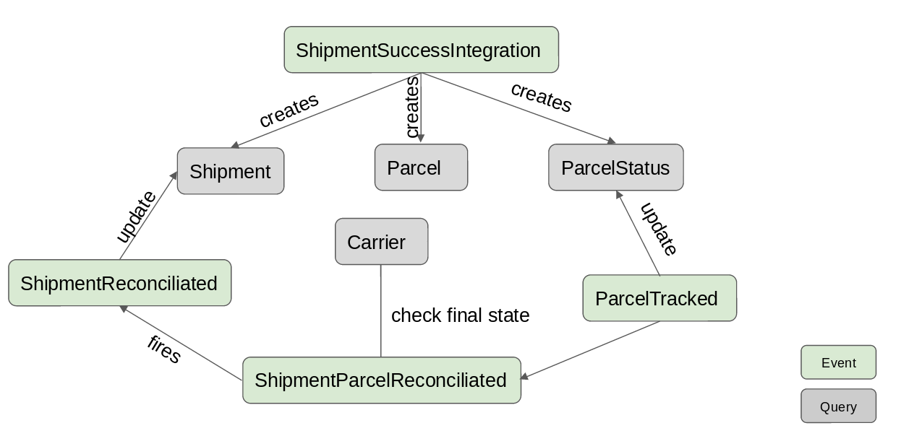
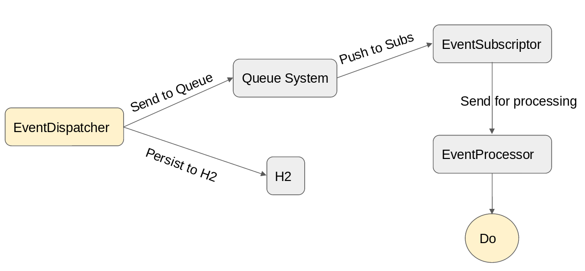

# Event Source - CQRS - H2
A sample project using Event Source, CQRS pattern using H2 database

## Context

Here we model the parcel's shipment processes using Event Sourcing and CQRS pattern.  

In this case study, there are three basic concepts that needs to be understood.

- A **shipment success integration** is the registering step within the system, is when the parcel is ready to be tracked through the updates performed in the shipment process.
  
- A **shipment entity** can contain more than one parcel.
  
- Parcel's **status changes** are events fired by an external system (that reflect updates performed in the shipment process, like DELIVERED), and we need to react to those events

### External events

- Shipment Success Integration  
	This event is generated when the parcel is ready to be tracked through the updates performed in the shipment process. An external system calls our endpoint **/events/carrier_success/** with the following info as content.    
	 
	- Shipment Info  
	- Parcels Info  
	- Tracking Info    
  	
- Parcel Tracking  
	This event is generated when some update is performed over the parcel to ship, the external system calls our endpoint **/events/parcel_tracked/** to notify our system that updated.
	   
	- Parcel weight  
	- Parcel status  
	
## The System

The solution is an implementation of event sourcing using CQRS pattern, using a Memory Queue System for this test and H2 as DB storage.

The update commands in our CQRS implementation, are events triggered by the platform and the system react to those events either dispatching new events and/or updating the query model, next image show both the update commands (events) and the query model.

 
	
	
### Events details

- **ShipmentSuccessIntegration**, is inserted fully in a table, for consistency, then is separated in *Shipment*, *Parcel* and ParcelStatus*
  
- **ParcelTracked**, updates the *ParcelStatus* entity and if the parcel tracked is conciliated, fires the *ShipmentParcelReconciliated* event
  
- **ShipmentParcelReconciliated**, check if all parcel from the Shipment are conciliated, if so, fires the *ShipmentReconciliated* event
  
- **ShipmentReconciliated**, updates the *ShipmentEntity* with the state 'sent_for_conciliation'
  
- **Event entities** are under package: *com.bussiness.events.domain.commands*
  
- **Model entities** are under package: *com.bussiness.events.domain.query*
  
- Event and model entities are stored in the **H2 database**

### Event handling architecture

The event handling is performed using the following architecture, the main component is the *Queue System*, that fulfill the ordering, storage and fault reaction (by using a buffer like storage for replaying events if needed) requirements of using the CQRS pattern.

	

EventDispatcher and EventProcessor can fail, either storing to database or inserting in the queue system, etc. For that, we use the *com.bussiness.events.core.IFailEventDispatchStrategy*, that allow to take actions on fail, for this test, just print to stdout

